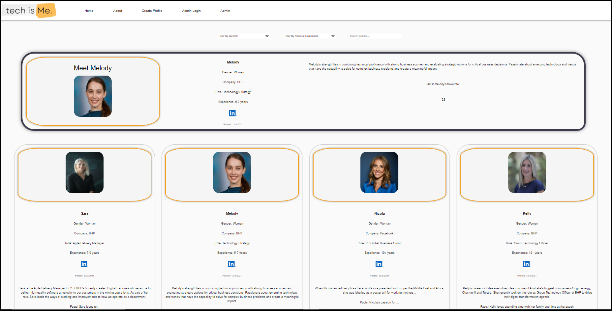

<h1>plus-bris-2021-robust-code-beans-drf</h1>

Too many times we have heard young people ask us questions such as "can women be software engineers?" or comments such as "there is no one in tech who looks like me".

 

At She Codes we are trying to change that, this website was created as a hub where the community can create profiles of women and non-binary folk. The idea would be that we could share this website to show young people that anyone can work in Tech.

 

This website is our our final group project for She Codes Brisbane Cohort 2021 and an example of women giving "Tech" a go! Our group, the Robust-Code-Beans, worked with our client Sara Borgstrom (BHP) to develop a MVP (Minimum Viable Product) website with the product aim above.

 

An MVP is the base features and functionality required by the client to meet initial approval. In the "real world" we would then continue to work through improvements and additional features in communication with the client until a final end point is reached.

 

We had only a few weeks to complete the MVP while all juggling work, family and other commitments. We did push ourselves to implement functionality that we had not used previously such as image uploding, filters based on multiple criteria, profile approval/decline process and also tried out MUI Library for our navigation. This was our first time working collaboratively using github which was a learning curve but part of the process.

 

Link to DRF GitHub repository: https://github.com/SheCodesAus/plus-bris-2021-robust-code-beans-drf

Deployed DRF project: https://frozen-anchorage-88305.herokuapp.com/

Link to React GitHub repository: https://github.com/SheCodesAus/plus-bris-2021-robust-code-beans-react

Deployed React project: https://warm-cove-19976.herokuapp.com/

<h4>Setup/Instructions - DRF</h4>

Git clone the repository: (https://github.com/SheCodesAus/plus-bris-2021-robust-code-beans-drf-beans-react)

Setup the virtual environment and install dependencies:

    <ul>
        <li><code>python3 --version</code>to ensure you have python 3.6+ installed</li>
        <li><code>virtualenv --version</code></li>
        <li><code>python -m virtualenv venv</code></li>
        <li><code>venv/Scripts/activate</code></li>
        <li><code>python -m pip install --upgrade pip</code></li>
        <li><code>pip install -r requirements.txt</code></li>
    </ul>

<h4>Setup/Instructions - React</h4>

Git clone the repository: (https://github.com/SheCodesAus/plus-bris-2021-robust-code-beans-react)

Create a new react app using the create-react-app tool:

    <ul>
        <li><code>npx create-react-app plus-bris-2021-robust-code-beans-react</code></li>
    </ul>

Navigate into the directory, install react-router-dom and start the app:

    <ul>
        <li><code>cd plus-bris-2021-robust-code-beans-react</code></li>
        <li><code>npm install react-router-dom</code></li>
        <li><code>npm start</code></li>
    </ul>

<h4>Run locally:</h4>

Run backend from new terminal:

<ul>
<li>Launch the server: <code>python manage.py runserver</code></li>
<li>Go to http://localhost:8000/ in your browser or test in Insomnia</li>
    </ul>

Run frontend from new terminal:

    <ul>
<li>Launch the client app from frontend directory: <code>npm start</code></li>
<li>Go to http://localhost:3000/</li>
</ul>

<h2>Stack</h2>

Tech is me was built with React. It is integrated with a backend API via<a href="https://github.com/SheCodesAus/plus-bris-2021-robust-code-beans-drf"> Django/DRF.</a>

<h4>Dependencies</h4>
react-router-dom: ^6.0.2
python 3.6+

<h2>Insomnia API Endpoints</h2>
<ol>
    <li>POST <code>profiles/</code> - Create new profile.</li>
    <li>POST <code>api-token-auth/</code> - Login</li>
    <li>GET <code>profiles/</code> - Return list of profiles.</li>
    <li>PUT <code>profiles/:id</code> - Update profile details.</li>
    <li>DELETE <code>profiles/:id</code> - Delete profile.</li>
</ol>

<h2>Screenshots</h2>

Screenshot displaying Home Page https://warm-cove-19976.herokuapp.com endpoint

Screenshot displaying About Page https://warm-cove-19976.herokuapp.com/about endpoint

Screenshot displaying Create Profile Form https://warm-cove-19976.herokuapp.com/create-profile endpoint

Screenshot displaying Admin Login Form https://warm-cove-19976.herokuapp.com/admin-login endpoint

Screenshot displaying Admin Page https://warm-cove-19976.herokuapp.com/admin endpoint

<h2>Functionality</h2>
<ul>
    <li>View profiles with a status of 'Approved'</li>
    <li>Sort and filter profiles by Gender or Experience</li>
    <li>Search for a profile</li>
    <li>Upload a profile</li>
    <li>Log in as an </li>
    <li>Administrator can approve or decline profiles</li>
</ul>

<h2>Features</h2>
<ul>
  <li>Random feature profile displaying at top of Home Page</li>
  <li>Website is accessable</li>
  <li>Real profiles of women in tech</li>
</ul>

<h4>Validation</h4>
<ul>
    <li>User sees validation messages if create profile form data is incomplete.</li>
    <li>User sees a confirmation message when profile is created successfully.</li>
</ul>

<h2>Permissions</h2>

<ul>
    <li>Anyone can create a profile</li>
    <li>Only an administrator can approve profiles</li>
    </ul>